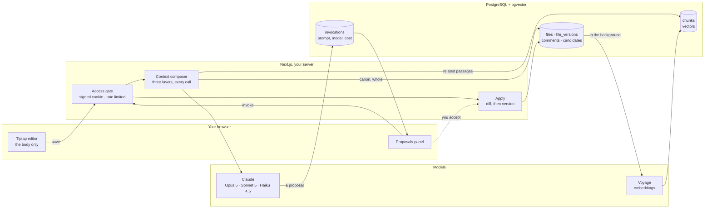
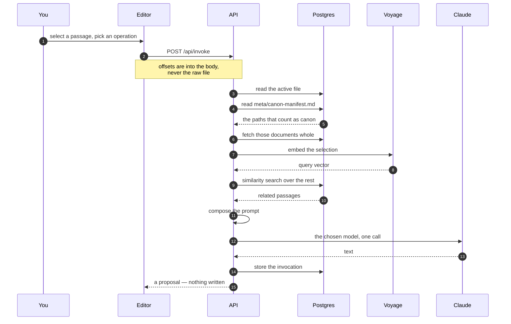
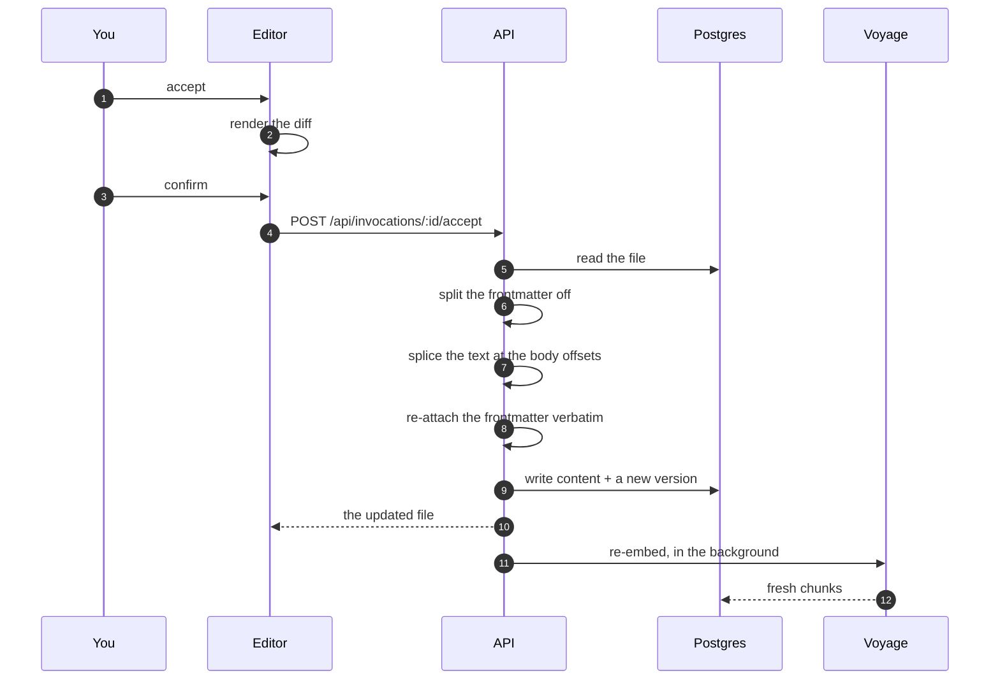
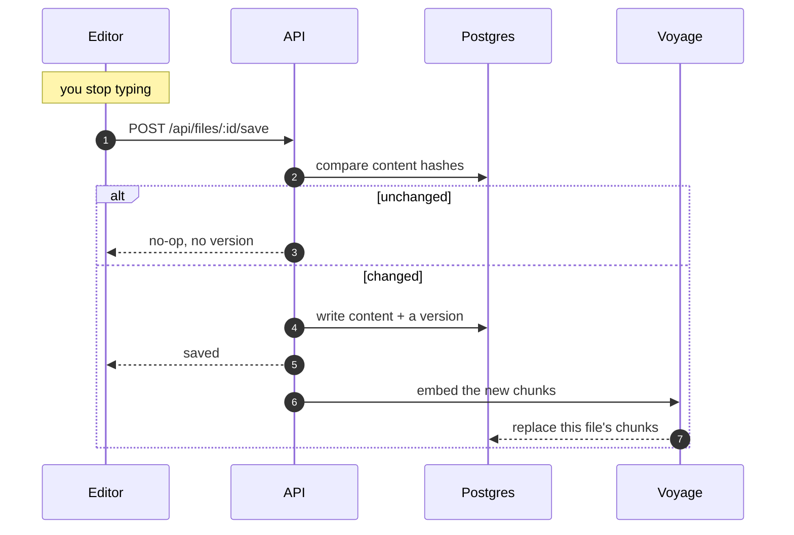

# Conato

[](https://github.com/carlosrendonduque/conato/actions/workflows/ci.yml)
[](LICENSE)

A WYSIWYG Markdown editor with Claude-powered writing assistance, built for
long-form work. Self-hosted, single-user, corpus-agnostic.

The name comes from the Latin *conatus*: the impulse, the effort, the gesture
just beginning.

> **Status: v0.1, single-user by design.** Conato was built as one author's
> writing tool and opened up because the shape of it turned out to be generally
> useful. It has no user accounts, no multi-tenancy and no billing — see
> [Security model](#security-model) before you put it on the open internet.
>
> Everything documented here has been exercised end to end against live APIs.
> Features that were not verified were removed rather than shipped on trust;
> [ROADMAP.md](ROADMAP.md) says what is missing and why.

## Why this exists

Writing with AI assistance usually means a browser tab next to your editor and
copy-pasting between the two. Context is lost at every hop, and the model
answers without knowing the rest of your work.

Conato collapses that into one interface. Your corpus lives on the server. Every
invocation automatically carries your canon, semantically relevant passages from
the rest of your material, and the full file you are editing. Answers arrive as
**proposals in a side panel** — never written straight into your text.

## See it work

Six short clips, each one feature, recorded against the bundled demo corpus.
The walkthrough that produced them is in [docs/demo.md](docs/demo.md).

**1 · The editor** — Markdown without the punctuation, and metadata that stays
out of the way.

https://github.com/user-attachments/assets/8437d1f8-63d0-4760-8129-549d655d798b

**2 · The five operations** — expand, condense, rewrite, continue and free
prompt, over a selection or at the cursor.

https://github.com/user-attachments/assets/ba35c939-20fc-4b3c-8303-fa4eaab3f324

**3 · Proposals** — accept behind a visual diff, discard, or keep as a
candidate that outlives the session.

https://github.com/user-attachments/assets/0cb40f5b-344d-4de1-9085-023ff37a58db

**4 · Choosing a model** — the same selection sent to Opus 5 and then Sonnet 5,
both answers side by side.

https://github.com/user-attachments/assets/aa1df97a-7d39-4c6f-a4de-ad6244925d40

**5 · Context** — why the proposals sound like the work: canon injected whole,
the rest of the corpus retrieved by similarity, the active file entire.

https://github.com/user-attachments/assets/513d6f37-4f77-4c5b-b1b8-0b4d123af8e7

**6 · Versions and comments** — every save kept, milestones tagged, restore,
and private notes anchored to the text.

https://github.com/user-attachments/assets/f318880e-faba-4096-b8ec-2290ecc264ef

## How it works

The model never touches your file. It is handed a copy of the relevant corpus
and returns text into a side panel; the only thing that writes to disk is you,
accepting something.

> **[Step through it →](https://carlosrendonduque.github.io/conato/)**
> The same three flows as an interactive schematic: the actors light up, the
> payload travels, and each step shows the call it actually makes.



**Two things this drawing is making a point about.** There is no arrow from
Claude to `files` — the only path into your text runs through the panel and a
diff you confirmed, which is why a bad proposal costs you a click rather than a
revert. And the composer reads the corpus on every single call instead of
holding a cached context, because the alternative is a model that answers
confidently about a paragraph you rewrote ten minutes ago.

### What happens when you ask for a proposal



The composer is the whole argument for the tool. Firm canon goes in **whole**,
because retrieving over a handful of small, load-bearing documents risks the
model simply not finding the rule it needed. Everything else is retrieved,
because prose grows without bound. The active file goes in entire, because when
the cursor sits on a blank line the rest of the file is the context.

### What happens when you accept one



The split-and-re-attach is not ceremony. Markdown reads `---` + text + `---` as
a horizontal rule followed by a heading, so frontmatter that reaches the editor
comes back as `## title: "..." kind: scene voice: ...` and every field is gone
on the next keystroke. Keeping the block out of the editor and pasting it back
untouched — rather than re-serializing it — is also what stops hand-written
YAML from being silently reordered.

### What happens while you write



Re-embedding happens after the response, not before it, so a save never waits
on a network call. If the embedding fails the old chunks stay and a manual
reindex is still there — retrieval degrades to slightly stale rather than
breaking, and your text is never what is at risk.

## What it does

- **WYSIWYG Markdown editing** on Tiptap, syntax hidden where possible.
- **Five operations**: expand, condense, rewrite, continue-from-cursor, and
  free-form prompt — invoked on a selection or at the cursor.
- **Model chosen per invocation** — Opus 5, Sonnet 5 or Haiku 4.5. Send the
  same operation to a second model and the side panel accumulates both answers
  so you can compare them.
- **Every output is a proposal.** Accepting one shows a visual diff first.
  Proposals can be accepted, discarded, or kept as candidates that persist.
- **Rich context on every call**: full canon documents, RAG over your material
  in production, the active file, and the cursor or selection.
- **Versioning**: granular background auto-save, manual milestone tagging, and
  restore from history.
- **Personal comments** anchored to text — notes to yourself, not visible to
  the model.
- **Retrieval stays current**: saving a file re-embeds it in the background, so
  proposals are never built on stale text.
- **Backups**: download the whole corpus as a ZIP, or any single file as
  Markdown.

### What it deliberately does not do

No "improve" operation (improvement implies the model judging what is better).
No fanning one prompt out to several models at once. No inline Cursor-style
suggestions while you type. No real auth, no multi-user, no PDF/EPUB export.
Scope discipline is part of the design — see [docs/architecture.md](docs/architecture.md).

## Quick start

Requirements: **Node.js 22+**, **Docker** (or any PostgreSQL 16+ with the
`pgvector` extension), and an Anthropic API key.

```bash
git clone https://github.com/carlosrendonduque/conato.git
cd conato
npm install

cp .env.example .env.local     # then fill in the values — see below
docker compose up -d           # PostgreSQL 16 + pgvector on :5432
npm run db:migrate

# Load the bundled public-domain demo corpus so the app has something to show
npm run corpus:ingest -- --dir ./examples/demo-corpus --slug demo --name "Demo Corpus"

npm run dev                    # http://localhost:3000
```

Log in with the value you set for `CONATO_ACCESS_SECRET`, then follow
[docs/demo.md](docs/demo.md) for a tour of what the tool does.

### Running everything in Docker

The command above runs the app on your machine against a containerised
database, which is the usual development loop. To run the whole stack in
containers instead:

```bash
docker compose --profile app up -d --build    # app on :3000, database on :5432
```

Generate the two required secrets with:

```bash
node -e "console.log(require('crypto').randomBytes(32).toString('hex'))"
```

### Environment variables

| Variable | Required | Purpose |
|---|---|---|
| `CONATO_ACCESS_SECRET` | **yes** | The shared secret that unlocks the app. 16+ chars. |
| `CONATO_COOKIE_SECRET` | **yes** | Signs the session cookie. Must differ from the above. |
| `DATABASE_URL` | **yes** | PostgreSQL with `pgvector`. |
| `ANTHROPIC_API_KEY` | for assistance | Without it the editor works but produces no proposals. |
| `VOYAGE_API_KEY` | for retrieval | Embeddings. Without it, ingestion stores files but cannot index them. |
| `CONATO_EDITOR_TOKEN` | no | Enables `/editor/<token>` read-only sharing. Unset means 404. |

API keys are read server-side only and are never sent to the browser.

## Bringing your own corpus

Conato edits plain `.md` files and does not care what they contain. The
conventions it understands:

- **`<base>.<lang>.md`** filenames, e.g. `chapter_01.es.md`.
- **Folders** mirroring your work's own hierarchy — one per voice, character,
  or section.
- **YAML frontmatter** carrying at minimum `title`, and optionally `kind`,
  `voice`, `act` and `order`, which drive the narrative index view.

Ingest any directory of Markdown:

```bash
npm run corpus:ingest -- --dir /path/to/corpus --slug my-work --name "My Work"
npm run corpus:ingest -- --help     # all flags
```

Files load as `production` by default; use `--layer meta` for documentation and
notes.

### Choosing what counts as firm canon

A file named **`meta/canon-manifest.md`** inside your corpus decides which
documents are injected **whole** into every prompt instead of being retrieved by
similarity. Any Markdown bullet in that file is read as a corpus path:

```markdown
- meta/canon.es.md
- character/protagonist.es.md
```

Keep the list short — those documents are paid for on every single call. The
manifest is ordinary corpus data, so you can edit it from inside Conato and the
next invocation picks it up; there is no redeploy and no configuration file.
(Corpora created before this convention may use the older path
`meta/manifiesto_canon_firme.es.md`, which is still honoured.)

See [examples/](examples/) for a working demonstration, manifest included.

## API surface

Every route sits behind the session cookie except `/api/health`,
`/api/auth/login` and `/editor/<token>`. There is no public API: this is the
editor talking to its own server.

| Route | Body | Returns |
|---|---|---|
| `POST /api/invoke` | `{ fileId, operation, selection? \| cursorPosition?, userPrompt?, model? }` | `{ invocationId, responseText, provider, model, usage }` |
| `POST /api/invocations/:id/accept` | — | `{ invocationId, versionId, content }` |
| `POST /api/invocations/:id/discard` | — | `{ status }` |
| `POST /api/invocations/:id/save-as-candidate` | — | `{ candidateId, status }` |
| `POST /api/candidates/:id/apply` | `{ selection \| cursorPosition }` | `{ content, versionId }` |
| `GET POST /api/files` | `{ path, content? }` | the file list, or the created file |
| `GET PATCH DELETE /api/files/:id` | `{ path? }` | the file, the rename, or the delete |
| `POST /api/files/:id/save` | `{ content }` | `{ versionId, contentHash, noop }` |
| `PATCH /api/files/:id/frontmatter` | any subset of the metadata | `{ frontmatter, shiftedCount }` |
| `GET POST /api/files/:id/versions` | `{ label }` to tag a milestone | history, or the new milestone |
| `POST /api/files/:id/versions/:vid/restore` | — | `{ content }` |
| `GET POST /api/files/:id/comments` | `{ body, anchorQuote, anchorPrefix?, anchorSuffix? }` | the comments, or the new one |
| `POST /api/files/:id/share` | `{ share: boolean }` | `{ share }` |
| `GET /api/files/:id/download` | — | the `.md` file, frontmatter included |
| `GET /api/admin/export-corpus` | — | the whole corpus as a ZIP |
| `POST /api/admin/reindex` | — | `{ filesIndexed, totalChunks }` |

`selection` carries `{ text, range: { from, to } }`. **Those offsets are into
the body, not the raw file** — the editor never sees the frontmatter, so the
server splits it off before splicing and re-attaches it afterwards.

Every invocation is stored with the prompt that produced it, the model that
answered, token counts and the chunks that were retrieved. Nothing about a
proposal is ephemeral except the proposal itself.

## Day-to-day commands

| Command | What it does |
|---|---|
| `npm run dev` | Editor on `http://localhost:3000` |
| `npm run build` | Production build |
| `npm run typecheck` | TypeScript, strict |
| `npm run lint` | ESLint |
| `npm test` | Vitest |
| `npm run format` | Prettier write |
| `npm run db:migrate` | Apply pending migrations |
| `npm run db:generate` | Generate a migration from the schema diff |
| `npm run db:studio` | Browse the database |
| `npm run corpus:ingest -- --dir <path> --slug <slug>` | Ingest a directory of Markdown |
| `npm run corpus:reset -- --dir <path> --slug <slug>` | Wipe that corpus and re-ingest it, with a confirmation |
| `npm run demo:reset` | The same, pointed at the bundled demo, non-interactive |
| `docker compose up -d` | PostgreSQL 16 + pgvector |
| `docker compose --profile app up -d --build` | The whole stack in containers |

## Corpus conventions

Conato is agnostic about content but expects a shape. None of it is enforced —
a file that ignores all of it still works, it just carries less into the
prompt.

| Convention | Example | What reads it |
|---|---|---|
| `<base>.<lang>.md` | `capitulo_01.es.md` | language on the file, and the base name |
| folder per voice or section | `personaje/sancho_panza.es.md` | the first path segment becomes the voice hint in the prompt |
| `title` in frontmatter | `title: "La aventura…"` | file lists, the shared reader |
| `kind` | `scene`, `character`, `document`, `note`… | the narrative index; constrained by the schema |
| `act` and `order` | `act: 1`, `order: 2` | ordering in the index view; renumbering shifts neighbours |
| `voice` | `voice: narrador` | passed to the model as a register hint |
| `share_external: true` | — | exposes the file at `/editor/<token>` |
| `meta/canon-manifest.md` | a list of Markdown bullets | decides what is injected whole into every prompt |

## Security model

Conato's access control is **one shared secret**, not user accounts. That is
adequate for a personal instance at an unadvertised URL, and it is not a
substitute for authentication. Before deploying:

- Use a long random `CONATO_ACCESS_SECRET`. The app refuses to start on the
  example placeholders or on low-entropy values, but it cannot stop you from
  choosing something weak.
- Login attempts are rate-limited per client, best-effort and in-process. On a
  serverless host, each instance counts separately.
- Anyone holding the shared secret has full read and write access to the whole
  corpus.

To report a vulnerability, see [SECURITY.md](SECURITY.md).

## Deploying

[](https://vercel.com/new/clone?repository-url=https%3A%2F%2Fgithub.com%2Fcarlosrendonduque%2Fconato&env=CONATO_ACCESS_SECRET,CONATO_COOKIE_SECRET,DATABASE_URL,ANTHROPIC_API_KEY,VOYAGE_API_KEY&envDescription=Access%20secrets%2C%20a%20Postgres%20URL%20with%20pgvector%2C%20and%20an%20Anthropic%20API%20key&envLink=https%3A%2F%2Fgithub.com%2Fcarlosrendonduque%2Fconato%23environment-variables&project-name=conato&repository-name=conato)

You will still need to run migrations once against the database before the app
works — see below.

Conato runs on any host that can serve a Next.js app and reach a PostgreSQL
database with `pgvector` — Vercel + Neon, Fly.io, a VPS with Docker.

For Vercel + Neon: enable `vector` on the Neon project
(`CREATE EXTENSION vector;`), run `npm run db:migrate` once against the
**direct** endpoint, then set `DATABASE_URL` in Vercel to the **pooled**
endpoint so serverless functions do not exhaust connections.

## Stack

Next.js 15 (App Router, strict TypeScript) · PostgreSQL + pgvector via Drizzle
ORM · Vercel AI SDK · Tiptap · Tailwind CSS 4.

## Documentation

- [docs/demo.md](docs/demo.md) — a guided tour of every feature using the
  bundled public-domain corpus, with a reset between runs
  (también [en español](docs/demo.es.md)).
- [docs/architecture.md](docs/architecture.md) — how context is composed, the
  data model, and the reasoning behind the constraints.
- [CONTRIBUTING.md](CONTRIBUTING.md) — development setup and what kind of
  contributions fit.
- [ROADMAP.md](ROADMAP.md) — what is planned and what is deliberately excluded.

## License

MIT — see [LICENSE](LICENSE).

The demo corpus under `examples/demo-corpus/` quotes *Don Quijote de la Mancha*
by Miguel de Cervantes, which is in the public domain.
